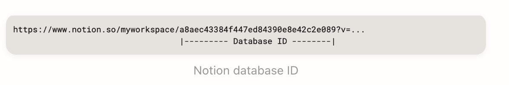

# Notion To Obsidian migrator (n2o)

Migration tool for your Notion workspace to Obsidian.

The current importer tool landscape usually requires you to import your entire workspace, does not allow you to select which page properties you would like to import, or fails to create a link between pages. 

With `n2o`, you have complete control over what you import from your Notion workspace to your Obsidan vault.


## Install

Download the `n2o` artifact from the [releases page](https://github.com/GustavoCaso/n2o/releases).

## Usage

```
$ n2o
Usage of n2o:
  -download-images
    	download external images to the Obsidian vault
  -notion-db-ID string
    	Notion database to migrate
  -notion-page-ID string
    	Notion page to migrate
  -notion-token string
    	Notion token
  -page-name string
    	Notion page properties to extract the Obsidian page title.
    	Support selecting different page attributes and formatting. To select multiple properties, use a comma-separated list.
    	The attributes that support custom formatting are Notion date attributes.
    	Example of how to use a Notion date property with custom format as the title for the Obsidian page:
    	-name=date:%Y/%B/%d-%A

    	By default if you do not configure any we get the Title property

  -page-properties string
    	Notion page properties to convert to Obsidian frontmater.
    	You can select multiple properties using a comma-separated list.

  -save-to-disk
    	write the pages in the Obsidian vault
  -vault-folder string
    	folder to store pages inside the Obsidian Vault
  -vault-path string
    	Obsidian vault location
```

## How do you get your Notion token?

To get your Notion token, you either have to create an integration or use an existing integration that has access to the workspace you want to migrate. The Notion website has many resources.

- [What is an Integration](https://developers.notion.com/docs/getting-started#what-is-a-notion-integration)
- [Build your first integration Guide](https://developers.notion.com/docs/create-a-notion-integration)

Once your integration is installed in your workspace, we can migrate single pages or complete databases to our Obsidian vault.

## How do I get the database ID?

Copied from the Notion website: [Retrieve a database](https://developers.notion.com/reference/retrieve-a-database)

> To find a database ID, navigate to the database URL in your Notion workspace. The ID is the string of characters in the URL that is between the slash following the workspace name (if applicable) and the question mark. The ID is a 32 characters alphanumeric string.



## How do I retrieve the Page ID?

Copied from the Notion website: [Working with page content](https://developers.notion.com/docs/working-with-page-content)
> Here's a quick procedure to find the page ID for a specific page in Notion: 
Open the page in Notion. Use the Share menu to Copy link. Now paste the link in your text editor so you can take a closer look. The URL ends in a page ID.
It should be a 32 character long string. Format this value by inserting hyphens (-) in the following pattern: 8-4-4-4-12 (each number is the length of characters between the hyphens).
Example: 1429989fe8ac4effbc8f57f56486db54 becomes 1429989f-e8ac-4eff-bc8f-57f56486db54.
This value is your page ID.

## Supported Notion blocks to Obsidian markdown

- [x] bookmark
- [x] bulleted_list_item
- [x] callout
- [x] child_database
- [x] child_page
- [x] column
- [x] column_list
- [x] divider
- [x] embed
- [x] equation
- [x] file
- [x] heading_1
- [x] heading_2
- [x] heading_3
- [x] image
- [x] link_preview
- [x] link_to_page
- [x] numbered_list_item
- [x] paragraph
- [x] pdf
- [x] quote
- [ ] synced_block
- [x] table
- [x] table_of_contents
- [x] table_row
- [x] to_do
- [x] toggle
- [x] unsupported
- [x] video

## Supported Notion page properties to Obsidian frontmatter

- [x] checkbox
- [x] created_by
- [x] created_time
- [x] date
- [x] email
- [ ] files (No information from the Notion API)
- [ ] formula (No equivalent in Obsidian)
- [x] last_edited_by
- [x] last_edited_time
- [x] multi_select
- [x] number
- [ ] people (No information from the Notion API)
- [x] phone_number
- [x] relation
- [x] rich_text
- [x] rollup
- [x] select
- [x] status
- [x] title
- [x] url

## Supported Notion rich text mentions. Every mention would create a link between notes.

- [ ] database (Partial support. We do not fetch the datadase pages)
- [x] date 
- [x] link_preview 
- [x] page 
- [ ] template_mention (No equivalent in Obsidian)
- [ ] user

## Known Limitations

Child page and child datadase blocks do not include information that allow to query the Notion API. If you want to migrate those you would have to manually call `n2o`

## Examples

### Get information about the pages that would be created in your Obsidian Vault
```
n2o -notion-token="NOTION_TOKEN" \
-notion-page-ID="1429989f-e8ac-4eff-bc8f-57f56486db54" \
-page-properties="all" \
-vault-path="/Users/johndoe/Obsidian\ Vault/Testing" \
-vault-folder="Migrated"
```

The command prints the pages that would be created in the Obsidian vault and their references. The reference is displayed with `|->` 

```
fetching notion pages information 100% |███████████████████████████████████████████████| (7/7, 17 it/min)
[INFO] Displaying the pages that would be created in your vault
Weekly Plan/Wednesday.md
 |-> Meals/Egg Muffins.md
 |-> Meals/Quinoa and Black Bean Bowl.md
 |-> Meals/Beef Stir-Fry.md
Weekly Plan/Monday.md
 |-> Meals/Overnight Oats.md
 |-> Meals/Chicken Salad.md
 |-> Meals/Turkey Stuffed Peppers.md
Weekly Plan/Sunday.md
 |-> Meals/Overnight Oats.md
 |-> Meals/Chicken Salad.md
 |-> Meals/Salmon and Asparagus.md
Weekly Plan/Thursday.md
 |-> Meals/Overnight Oats.md
 |-> Meals/Smoothie.md
 |-> Meals/Salmon and Asparagus.md
```

### Download a single page and convert all page properties to frontmatter
```
n2o -notion-token="NOTION_TOKEN" \
-notion-page-ID="1429989f-e8ac-4eff-bc8f-57f56486db54" \
-page-properties="all" \
-vault-path="/Users/johndoe/Obsidian\ Vault/Testing" \
-vault-folder="Migrated" \
-save-to-disk
```

### Download a full database and images, and convert some page properties to frontmatter
```
n2o -notion-token="NOTION_TOKEN" \
-notion-page-ID="668d797c-76fa-4934-9b05-ad288df2d136" \
-page-properties="location" \
-vault-path="/Users/johndoe/Obsidian\ Vault/Testing" \
-vault-folder="Migrated" \
-download-images \
-save-to-disk
```

### Download a complete database and customize the resulting Obsidan page name
```
n2o -notion-token="NOTION_TOKEN" \
-notion-page-ID="668d797c-76fa-4934-9b05-ad288df2d136" \
-page-name="date:%Y/%B/%d-%A" \
-vault-path="/Users/johndoe/Obsidian\ Vault/Testing" \
-vault-folder="Migrated" \
-download-images \
-save-to-disk
```

For these examples, the location of the different pages would be based dynamically on the `date` value in the Notion page property and the custom format `%Y/%B/%d-%A`. For a list of available formatting options for dates, refer to [man 3 strftime](https://linux.die.net/man/3/strftime)

A notion page with the date value `2024-09-30` would be stored in: `/Users/johndoe/Obsidian\ Vault/Testing/Migrated/2024/September/09-Monday`

## Roadmap

- [ ] Figure out how to parse self-referential links. Transform links like `/<Notion_PAGE_ID>#<BLOCK_ID>` to `[[Page^Block_ID]]` or `[[Page#Block_ID]]`
- [ ] Add more unit tests
- [ ] Add support for custom configuration file. The configuration file allows to specify the different DB and pages that we want to migrate and their properties, increasing the usabilty of `n2o`.
- [ ] Create a HomeBrew formula

## Contributing
Pull requests are welcome. Feel free to...

- Revise documentation
- Add new features
- Fix bugs
- Suggest improvements
